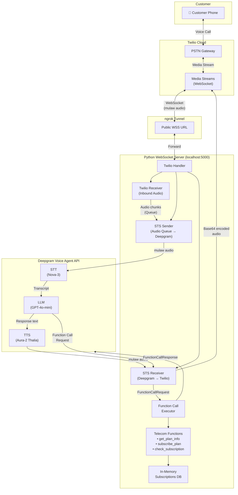
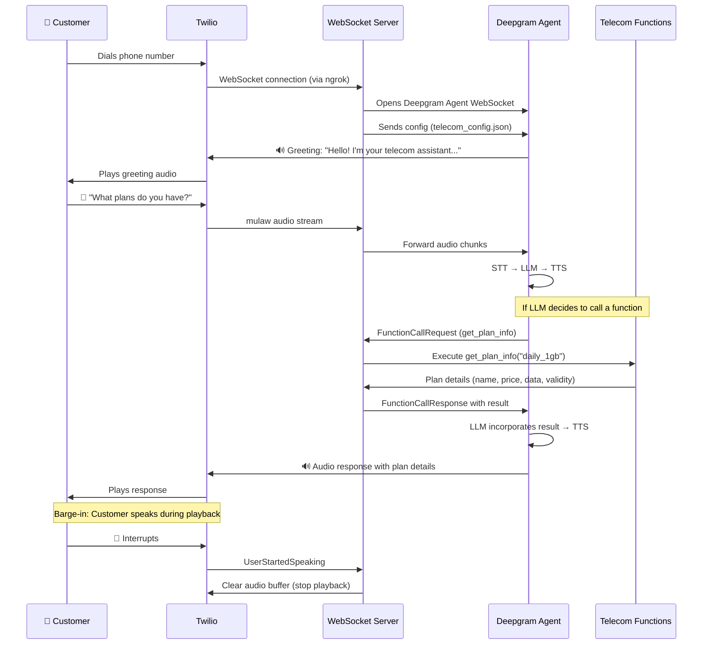

# 📞 Telecom Customer Care Voice Agent

A real-time AI-powered voice agent for telecom customer care, handling internet data package inquiries and activations over phone calls. Built with **Deepgram Voice Agent API**, **Twilio**, and **OpenAI GPT-4o-mini**.

## System Architecture



## Call Flow Sequence



## Project Structure

```
Project02/
├── main.py                 # WebSocket server — bridges Twilio ↔ Deepgram
├── telecom_functions.py    # Business logic — plans DB & subscription management
├── telecom_config.json     # Deepgram agent config — STT, LLM, TTS settings
├── .env                    # Environment variables (API keys)
├── pyproject.toml          # Python dependencies (managed by uv)
├── uv.lock                 # Dependency lock file
└── README.md               # This file
```

## Prerequisites

- **Python** 3.14+
- **[uv](https://docs.astral.sh/uv/)** — Python package manager
- **[ngrok](https://ngrok.com/)** — Tunnel for exposing local server
- **Twilio Account** — With a phone number configured for Media Streams
- **Deepgram API Key** — For Voice Agent API access
- **OpenAI API Key** — Configured in your Deepgram account for LLM (GPT-4o-mini)

## Setup & Installation

### 1. Clone the Repository

```bash
git clone <repository-url>
cd Project02
```

### 2. Install Dependencies

```bash
uv sync
```

### 3. Configure Environment Variables

Create a `.env` file in the project root:

```env
DEEPGRAM_API_KEY=your_deepgram_api_key_here
```

### 4. Start ngrok Tunnel

In a separate terminal:

```bash
ngrok http 5000
```

Copy the `wss://` URL from the ngrok output.

### 5. Configure Twilio

1. Go to your [Twilio Console](https://console.twilio.com/)
2. Navigate to your phone number settings
3. Under **Voice & Fax → A Call Comes In**, select **TwiML Bin** or configure via webhook
4. Set up a TwiML response that connects to your ngrok URL:

```xml
<Response>
    <Connect>
        <Stream url="wss://your-ngrok-url.ngrok-free.app" />
    </Connect>
</Response>
```

### 6. Run the Server

```bash
uv run main.py
```

The server will start on `ws://localhost:5000`. Now call your Twilio phone number!

## Available Data Plans

| Plan ID          | Name              | Price  | Data  | Validity |
|------------------|-------------------|--------|-------|----------|
| `daily_1gb`      | Daily 1GB Plan    | $1.50  | 1GB   | 1 day    |
| `weekly_5gb`     | Weekly 5GB Plan   | $5.99  | 5GB   | 7 days   |
| `monthly_20gb`   | Monthly 20GB Plan | $15.99 | 20GB  | 30 days  |

## Agent Capabilities

| Function              | Description                                    |
|-----------------------|------------------------------------------------|
| `get_plan_info`       | Retrieve details about a specific data plan    |
| `subscribe_plan`      | Activate a data plan for a customer            |
| `check_subscription`  | Look up subscription status by ID              |

## Configuration

The voice agent is configured via [`telecom_config.json`](telecom_config.json):

| Component  | Provider  | Model              | Purpose                    |
|------------|-----------|--------------------|-----------------------------|
| **Listen** | Deepgram  | `nova-3`           | Speech-to-Text              |
| **Think**  | OpenAI    | `gpt-4o-mini`      | Conversational reasoning    |
| **Speak**  | Deepgram  | `aura-2-thalia-en` | Text-to-Speech              |

Audio is encoded in **mulaw at 8000Hz** to match Twilio's telephony format.

## Key Features

- **Real-time voice conversation** — Full-duplex audio streaming via WebSockets
- **Barge-in support** — Customer can interrupt the agent mid-sentence
- **Function calling** — LLM triggers backend functions to look up plans and activate subscriptions
- **Natural speech** — Prompt engineered to avoid markdown/bullets and speak conversationally

## Tech Stack

| Technology  | Role                                      |
|-------------|-------------------------------------------|
| Python      | Server runtime                            |
| websockets  | WebSocket server & client                 |
| Deepgram    | STT (Nova-3) + TTS (Aura-2) + Agent API  |
| OpenAI      | LLM reasoning (GPT-4o-mini via Deepgram)  |
| Twilio      | Telephony & Media Streams                 |
| ngrok       | Local tunnel to public internet           |

## License

This project is for educational and demonstration purposes.
